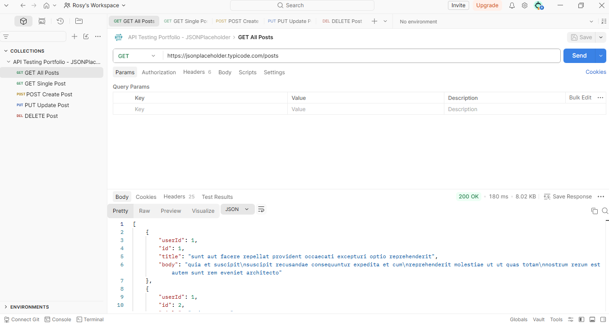
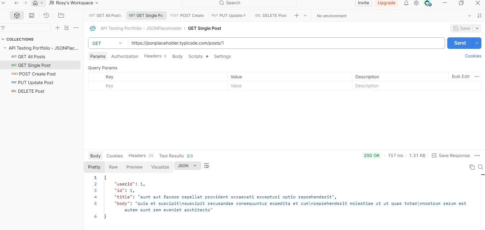
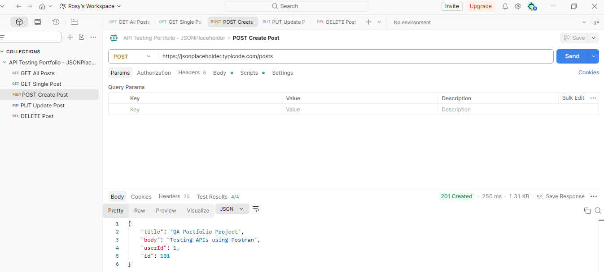
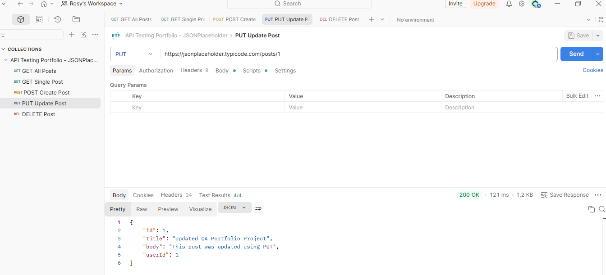
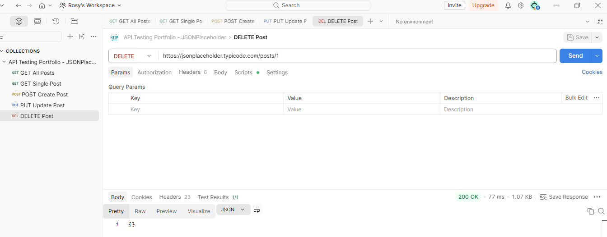
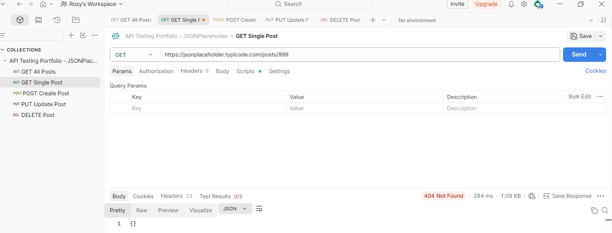

# API Testing Portfolio

## Overview

This project demonstrates API testing using Postman and the JSONPlaceholder REST API.

The goal was to validate API endpoints, verify responses, execute CRUD operations, and perform both positive and negative testing scenarios.

## Tools Used

- Postman
- JSONPlaceholder API
- GitHub

## Test Scenarios

### GET All Posts
- Verified status code 200 OK
- Validated response structure

### GET Single Post
- Verified status code 200 OK
- Validated post ID
- Validated title field
- Automated validations using Postman scripts

### POST Create Post
- Verified status code 201 Created
- Validated title
- Validated userId
- Validated generated ID

### PUT Update Post
- Verified status code 200 OK
- Validated updated title
- Validated updated body
- Validated ID consistency

### DELETE Post
- Verified successful deletion response
- Verified status code 200 OK

### Negative Testing
- Tested non-existing resource
- Verified status code 404 Not Found
- Verified empty response body

## Skills Demonstrated

- API Testing
- Functional Testing
- CRUD Operations
- Positive Testing
- Negative Testing
- Response Validation
- Postman Test Scripts
- REST API Testing

## Screenshots

### GET All Posts

### GET Single Post

### POST Create Post

### PUT Update Post

### DELETE Post

### Negative Test - 404

